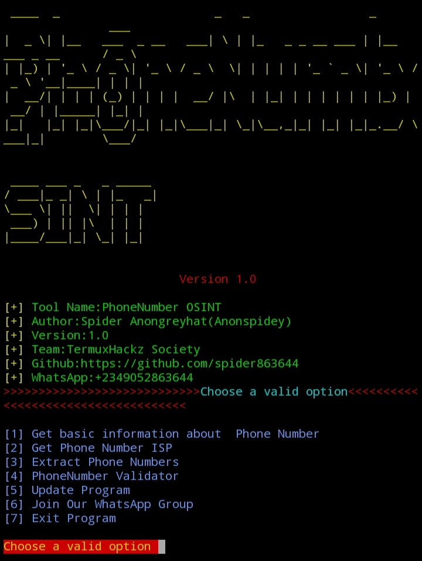
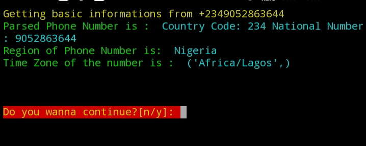

# phonenumber-osint
# PhoneNumber-OSINT
An OSINT tool for gathering information about phone numbers
<br>
It was created by Lucky Anongreyhat (Anonspidey) <br><br>

## Screenshot
<br><br>
<br>

## How To install PhoneNumber-OSINT on termux:

```
apt update && apt upgrade 

apt install python3

apt install git

apt install pip

git clone https://github.com/LuckyHacker78/phonenumber-osint

cd phonenumber-osint

pip install -r requirements.txt

```
## Installation for Linux

```

sudo apt update && apt upgrade 

sudo apt install python3

sudo apt install git

sudo apt install pip

git clone https://github.com/LuckyHacker78/phonenumber-osint

cd phonenumber-osint

sudo pip install -r requirements.txt

```

## Usage:

```
python3 'phonenumber_osint.py'

```

### Disclaimer:
For educational purposes only

### Developer contacts
Instagram: @i_am_i.11<br>
https://www.instagram.com/i_am_i.11/


### Support Developer by
Following me on GitHub<br>
Leave a star<br>
Fork this repository
